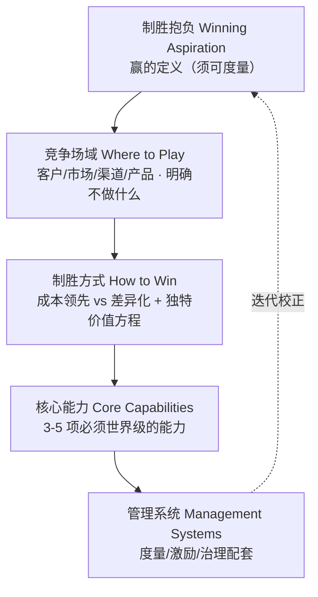

# T1 · 战略选择级联表（步骤 02）

> 来源：构建转型愿景.md v2.1 §5 T1。逐层约束，每层须显式记录「不选什么」（P1）。

| 层级 | 选择（做什么） | 明确不选什么 | 判断依据 / 负责人 |
|---|---|---|---|
| 制胜抱负 | | | |
| 竞争场域 | | | |
| 制胜方式 | | | |
| 核心能力 | | | |
| 管理系统 | | | |

**使用规则**：每层必须填写「不选什么」；上层约束下层，下层不得推翻上层；冲突取舍移交管理层裁决（T2 配套）。
